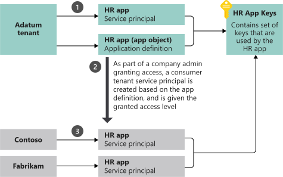

##

To delegate identity and access management functions to Azure AD, an application must be registered with an Azure AD

%

tenant

##

When you register your application with Azure AD, you're creating an identity configuration for your application that allows it to integrate with Azure

%

AD

##

When you register an app in the Azure portal, you choose whether it's a single tenant, or multi-tenant, and can optionally set a 

%

redirect URI

##

When you've completed the app `_____`, you have a globally unique instance of the app (the application object) which lives within your home tenant or directory. You also have a globally unique ID for your app (the app/client ID).

%

When you've completed the app **registration**, you have a globally unique instance of the app (the application object) which lives within your home tenant or directory. You also have a globally unique ID for your app (the app/client ID).

##

After you've completed the app registration, in the portal you can then add `_____` or `_____` and `_____` to make your app work, customize the branding of your app in the sign-in dialog, and more.

%

After you've completed the app registration, in the portal you can then add **secrets** or **certificates** and **scopes** to make your app work, customize the branding of your app in the sign-in dialog, and more.

##

If you register an application in the portal, an application object and a service principal object are automatically created in your home 

%

tenant

##

If you register/create an application using the Microsoft Graph APIs, creating the service principal object is a separate

%

step

##

An Azure AD application is defined by its one and only application `_____`, which resides in the Azure AD tenant where the application was registered (known as the application's "home" tenant).

%

An Azure AD application is defined by its one and only application **object**, which resides in the Azure AD tenant where the application was registered (known as the application's "home" tenant).

##

An application object is used as a template or blueprint to create one or more `_____` objects. A `_____` is created in every tenant where the application is used. Similar to a class in object-oriented programming, the application object has some static properties that are applied to all the created `_____`s (or application instances).

%

An application object is used as a template or blueprint to create one or more **service principal** objects. A **service principal** is created in every tenant where the application is used. Similar to a class in object-oriented programming, the application object has some static properties that are applied to all the created **service principal**s (or application instances).

##

The application object describes three aspects of an application:

- How the service can issue `_____` in order to access the application
- The `_____` that the application might need to access
- The `_____` that the application can take

%

- How the service can issue **tokens** in order to access the application
- The **resources** that the application might need to access
- The **actions** that the application can take

##

You can use the App registrations page in the Azure portal to list and manage the application objects in your home

%

tenant

##

The Microsoft Graph `_____` defines the schema for an application object's properties.

%

The Microsoft Graph **Application entity** defines the schema for an application object's properties.

##

To access resources that are secured by an Azure AD tenant, the entity that requires access must be represented by a security principal. This requirement is true for both users (`_____` principal) and applications (`_____` principal).

%

To access resources that are secured by an Azure AD tenant, the entity that requires access must be represented by a security principal. This requirement is true for both users (**user** principal) and applications (**service** principal).

##

The security principal defines the access policy and permissions for the user/application in the Azure AD tenant. This enables core features such as

- `_____`
- `_____`

%

- authentication of the user/application during sign-in
- and authorization during resource access

##

There are three types of service principal:

- `_____`
- `_____`
- `_____`

%

- Application
- Managed identity
- Legacy

##

A Service Principal of type `Application` is the `_____` representation, or application instance, of a global application object in a single tenant or directory.

%

A Service Principal of type `Application` is the **local** representation, or application instance, of a global application object in a single tenant or directory.

##

In the case of a Service Principal of type `Application`, a service principal a concrete instance created from the application `_____` and inherits certain properties from that application `_____`. A service principal is created in each tenant where the application is used and references the globally unique app `_____`. The service principal `_____` defines what the app can actually do in the specific tenant, who can access the app, and what resources the app can access.

%

In the case of a Service Principal of type `Application`, a service principal a concrete instance created from the application **object** and inherits certain properties from that application **object**. A service principal is created in each tenant where the application is used and references the globally unique app **object**. The service principal **object** defines what the app can actually do in the specific tenant, who can access the app, and what resources the app can access.

##

When an application is given permission to access resources in a tenant (upon registration or consent), a `_____` object is created. When you register an application using the Azure portal, a `_____` is created automatically. You can also create `_____` objects in a tenant using Azure PowerShell, Azure CLI, Microsoft Graph, and other tools.

%

When an application is given permission to access resources in a tenant (upon registration or consent), a **service principal** object is created. When you register an application using the Azure portal, a **service principal** is created automatically. You can also create **service principal** objects in a tenant using Azure PowerShell, Azure CLI, Microsoft Graph, and other tools.

##

The Managed Identity type of service principal is used to represent a managed identity. Managed identities eliminate the need for developers to manage `_____`. Managed identities provide an identity for applications to use when connecting to resources that support Azure AD authentication. When a managed identity is enabled, a service principal representing that managed identity is created in your tenant. Service principals representing managed identities can be granted access and permissions, but can't be updated or modified directly.

%

The Managed Identity type of service principal is used to represent a managed identity. Managed identities eliminate the need for developers to manage **credentials**. Managed identities provide an identity for applications to use when connecting to resources that support Azure AD authentication. When a managed identity is enabled, a service principal representing that managed identity is created in your tenant. Service principals representing managed identities can be granted access and permissions, but can't be updated or modified directly.

##

The Legacy type of service principal represents a legacy app, which is an app created before app `_____`s were introduced or an app created through legacy experiences. A legacy service principal can have credentials, service principal names, reply URLs, and other properties that an authorized user can edit, but doesn't have an associated app `_____`. The service principal can only be used in the tenant where it was created.

%

The Legacy type of service principal represents a legacy app, which is an app created before app **registration**s were introduced or an app created through legacy experiences. A legacy service principal can have credentials, service principal names, reply URLs, and other properties that an authorized user can edit, but doesn't have an associated app **registration**. The service principal can only be used in the tenant where it was created.

##

The Microsoft Graph `_____ entity` defines the schema for a service principal object's properties.

%

The Microsoft Graph `ServicePrincipal entity` defines the schema for a service principal object's properties.

##

You can use the `_____` page in the Azure portal to list and manage the service principals in a tenant. You can see the service principal's permissions, user consented permissions, which users have done that consent, sign in information, and more.

%

You can use the **Enterprise applications** page in the Azure portal to list and manage the service principals in a tenant. You can see the service principal's permissions, user consented permissions, which users have done that consent, sign in information, and more.

##

The application object is the `_____` representation of your application for use across all tenants, and the service principal is the `_____` representation for use in a specific tenant. The application object serves as the template from which common and default properties are derived for use in creating corresponding service principal objects.

%

The application object is the **global** representation of your application for use across all tenants, and the service principal is the **local** representation for use in a specific tenant. The application object serves as the template from which common and default properties are derived for use in creating corresponding service principal objects.

##

An application object has:

- A one-to-`_____` relationship with the software application, and
- A one-to-`_____` relationship with its corresponding service principal object(s)

%

- A one-to-**one** relationship with the software application, and
- A one-to-**many** relationship with its corresponding service principal object(s)

##

A `_____` must be created in each tenant where the application is used, enabling it to establish an identity for sign-in and/or access to resources being secured by the tenant. A single-tenant application has only one `_____` (in its home tenant), created and consented for use during application registration. A multi-tenant application also has a `_____` created in each tenant where a user from that tenant has consented to its use.

%

A **service principal** must be created in each tenant where the application is used, enabling it to establish an identity for sign-in and/or access to resources being secured by the tenant. A single-tenant application has only one **service principal** (in its home tenant), created and consented for use during application registration. A multi-tenant application also has a **service principal** created in each tenant where a user from that tenant has consented to its use.

##

Any changes that you make to your `_____` object are also reflected in its `_____` object in the application's home tenant only (the tenant where it was registered). This means that deleting an `_____` object will also delete its home tenant `_____` object. However, restoring that `_____` object through the app registrations UI won't restore its corresponding `_____`.

%

Any changes that you make to your **application** object are also reflected in its **service principal** object in the application's home tenant only (the tenant where it was registered). This means that deleting an **application** object will also delete its home tenant **service principal** object. However, restoring that **application** object through the app registrations UI won't restore its corresponding **service principal**.

##

The diagram illustrates the relationship between an application's application object and corresponding service principal objects in the context of a sample multi-tenant application called HR app. There are three Azure AD tenants in this example scenario:

Adatum - The tenant used by the company that developed the HR app
Contoso - The tenant used by the Contoso organization, which is a consumer of the HR app
Fabrikam - The tenant used by the Fabrikam organization, which also consumes the HR app
Relationship between app object and service principal object

In this example scenario:

1. `_____`
2. `_____`
3. `_____`

%

1. The process of creating the application and service principal objects in the application's home tenant.
2. When Contoso and Fabrikam administrators complete consent, a service principal object is created in their company's Azure AD tenant and assigned the permissions that the administrator granted. Also note that the HR app could be configured/designed to allow consent by users for individual use.
3. The consumer tenants of the HR application (Contoso and Fabrikam) each have their own service principal object. Each represents their use of an instance of the application at runtime, governed by the permissions consented by the respective administrator.
