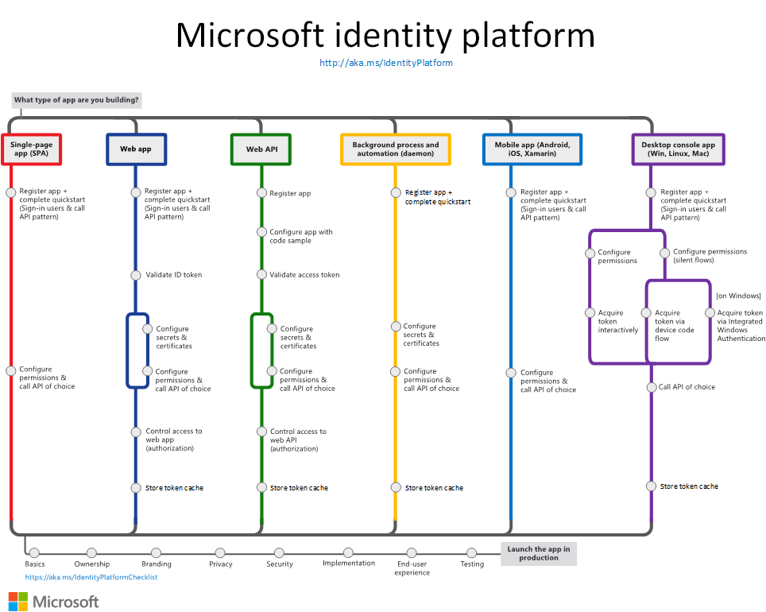

##

Microsoft identity platform, formerly

%

Azure Active Directory v2.0

(Note from editor, not in this area of the official docs)

##

The Microsoft identity platform helps you build applications your users and customers can sign in to using

- `_____`
- `_____`

%

- their Microsoft identities
- or social accounts

##

Microsoft identity platform authorizes access to your own `_____` or Microsoft `_____` like Microsoft Graph.

%

Microsoft identity platform authorizes access to your own **APIs** or Microsoft **APIs** like Microsoft Graph.

##

There are several components that make up the Microsoft identity platform:

- `_____`
- Open-source libraries
- Application management portal
- Application configuration API and PowerShell
- Developer content

%

- OAuth 2.0 and OpenID Connect standard-compliant authentication service
- Open-source libraries
- Application management portal
- Application configuration API and PowerShell
- Developer content

##

OAuth 2.0 and OpenID Connect standard-compliant authentication service enable developers to authenticate several identity types, including:

- Work or school accounts, provisioned through Azure `_____`
- Personal `_____` accounts (Skype, Xbox, Outlook.com)
- Social or local accounts, by using Azure AD `_____`

%

- Work or school accounts, provisioned through Azure **AD**
- Personal **Microsoft** accounts (Skype, Xbox, Outlook.com)
- Social or local accounts, by using Azure AD **B2C**

##

Microsoft identity platform leveragees open-source libraries:

- Microsoft `_____` Library (`_____`)
- and support for other `_____`-compliant libraries

%

- Microsoft **Authentication** Library (**MSAL**)
- and support for other **standards**-compliant libraries

##

Microsoft identity platform has a registration and configuration experience in the `_____` portal, along with the other `_____` management capabilities.

%

Microsoft identity platform has a registration and configuration experience in the **Azure** portal, along with the other **Azure** management capabilities.

##

Microsoft identity platform allows programmatic configuration of your applications through the Microsoft `_____` API and `_____` so you can automate your DevOps tasks.

%

Microsoft identity platform allows programmatic configuration of your applications through the Microsoft **Graph** API and **PowerShell** so you can automate your DevOps tasks.

##

Microsoft identity platform's developer content includes:

- Technical documentation
  - quickstarts
  - tutorials
  - how-to guides
  - and `_____` samples

  %

- Technical documentation
  - quickstarts
  - tutorials
  - how-to guides
  - and **code** samples

##

For developers, the Microsoft identity platform offers integration of modern innovations in the identity and security space like

- passwordless `_____`
- step-up `_____`
- and Conditional `_____`

%

- passwordless **authentication**
- step-up **authentication**
- and Conditional **Access**

##

With the Microsoft `_____` platform, you can write code once and reach any user. You can build an app once and have it work across many platforms, or build an app that functions as both a client and a resource application (API).

%

With the Microsoft **identity** platform, you can write code once and reach any user. You can build an app once and have it work across many platforms, or build an app that functions as both a client and a resource application (API).

##

Microsoft identity platform documented application scenarios:

- `_____`
- `_____`
- `_____`
- `_____`
- `_____`
- `_____`
- `_____`
- `_____`

%

- Single-page app (SPA)
- Web app that signs in users
- Web app that calls web APIs
- Protected web API
- Web API that calls web APIs
- Desktop app
- Daemon app
- Mobile app
